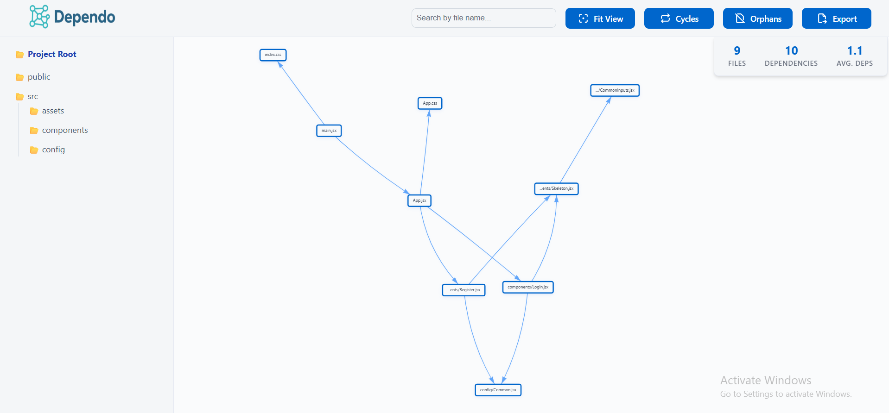
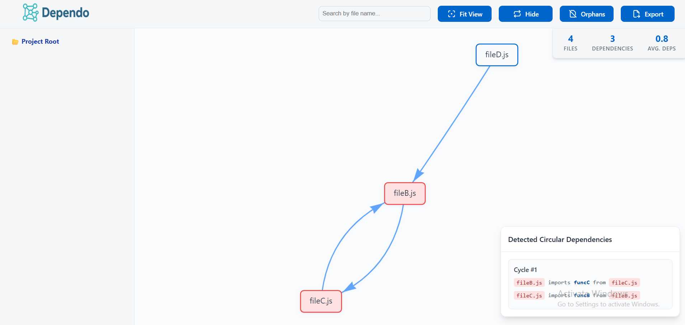
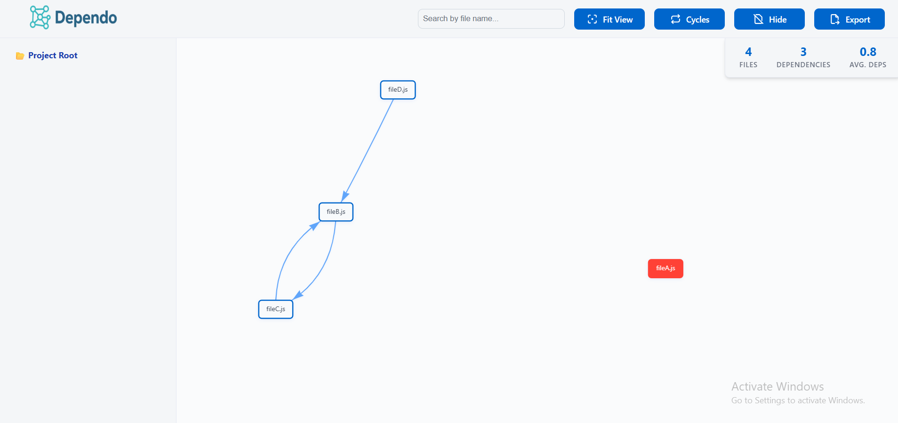
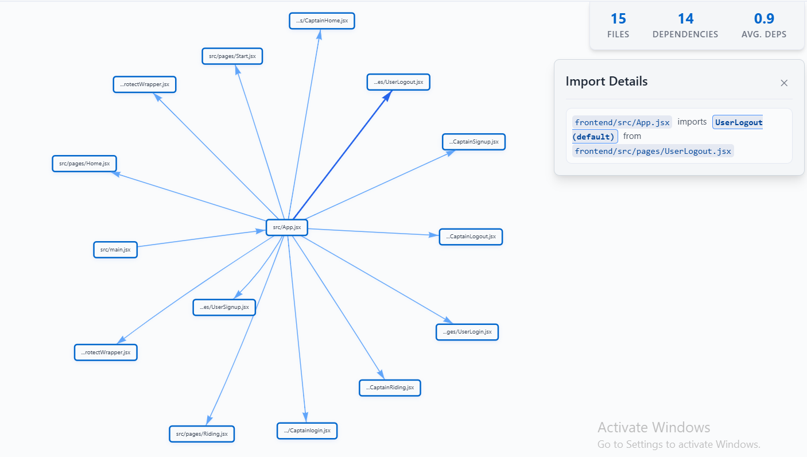
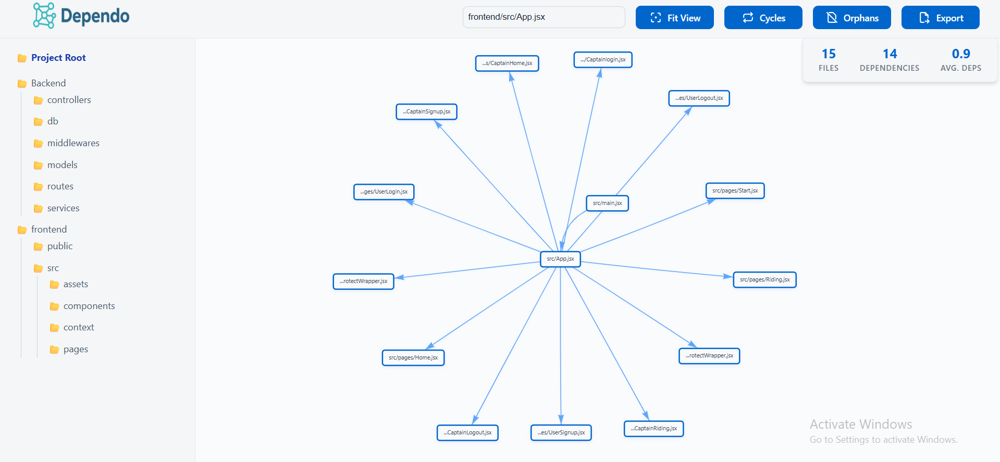
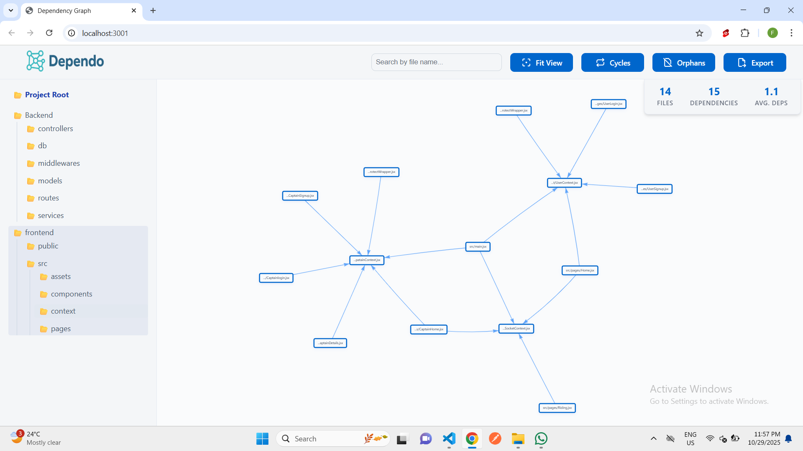

# Welcome to Dependo

## Visualize your codebase. Spot cycles fast. Ship cleaner architecture.

Dependo is a powerful VS Code extension that turns your JavaScript and TypeScript projects into an **interactive dependency graph**.  
It visualizes your project’s architecture by generating dependency graphs, detecting circular dependencies, finding orphan files, and enabling file-level dependency search.

Explore your codebase like never before — see how every file connects. 
Built for developers who crave clarity, maintainability, and smarter refactoring.

### ✨ Key Features

* **Interactive Dependency Graph:** Pan, zoom, select, and focus nodes for instant context and clearer visualization of file relationships.
* **Cycle Detection:** **See circular dependencies** with clear, navigable cycle details to avoid unexpected bugs and improve module decoupling.
* **Orphan Highlighting:** Easily surface files that aren’t connected to the main dependency graph (e.g., unused or experimental files).
* **Exportable Graphs:** Save the dependency graph as a PNG file to share or analyze elsewhere.
* **Folder-Aware Navigation:** Browse your files via a familiar tree and jump directly to graph selections.
* **Smart Search:** Find files/modules fast and instantly spotlight their relationships within the graph, enabled with auto-complete capabilities.
* **Import Relationship Inspection:** Click any edge between two nodes to see the exact import statements creating the dependency.
* **Built-in Stats:** Get a snapshot of file count, dependencies, and potential hotspots (Avg. Deps).
* **Lightweight and Fast:** Built using a React + Vite webview for a smooth, responsive in-editor experience.

## 📸 Dependo in Action

#### Dependency Graph Display:

#### Cyclic Dependecy Detection:

#### Orphan File Detection:

#### Import Relationship Inspection:

#### File Level Depedency Graph:

#### Folder Level Depedency Graph:

#### Autocomplete Sugestions:

#### Zoom, Fit, Pan:

